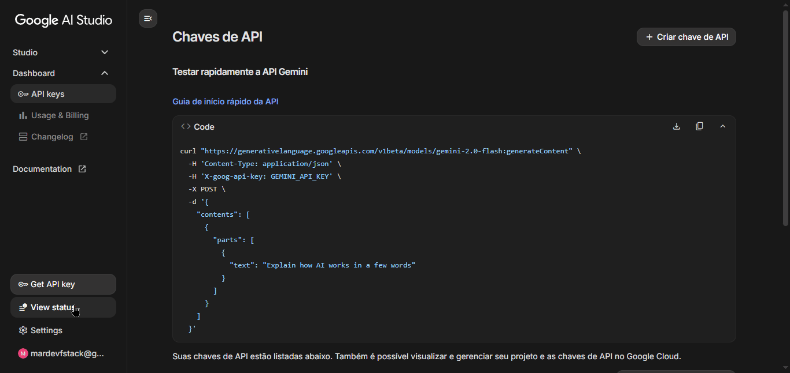
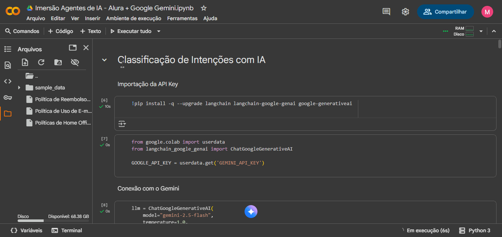

<div align="center"> <h1 align="center">🤖 Imersão Agentes de IA - Alura + Google Gemini</h1>
Notebook de imersão em agentes de Inteligência Artificial desenvolvido em Python 3.12, integrando conceitos de IA generativa para aprendizado prático e experimentação de agentes inteligentes. Projeto modular, didático e interativo.

<p align="center"> <a href="https://www.python.org/">  </a> <a href="https://platform.openai.com/">  </a> <a href="./LICENSE">  </a>   </p> </div>

---

<a id="visao-geral"></a>
## 🔎 Visão Geral

O notebook “Imersão Agentes de IA” permite:
- Explorar conceitos de agentes inteligentes e IA generativa.
- Criar e testar scripts interativos para experimentos de IA.
- Aprender boas práticas de modularização de código em Python.
- Integrar ferramentas e APIs de IA, incluindo OpenAI GPT.

> 💡 **Por que este projeto é relevante?**  
> Permite estudo prático e interativo de **agentes de IA**, experimentação com **modelos generativos** e consolidação de conceitos em **Python e IA**.

---

✨ Demonstração Visual
🔹 Configuração


🔹 Visualização de Resposta do Agente


### ✨ Funcionalidades Principais
- 🧠 Experimentos com agentes de IA
- 🤖 Integração com modelos generativos (OpenAI / Google Gemini)
- 📊 Visualização e análise de resultados dentro do notebook
- 📝 Documentação e exemplos comentados

---

<a id="execucao-local"></a>
## 🚀 Execução Local

### ⚙️ Pré-requisitos
- 
- Jupyter Notebook ou Jupyter Lab

### ⬇️ Como abrir o notebook
1️⃣ Clone o repositório:
```bash
git clone https://github.com/marcelonovello/AgentsIA.git
cd AgentsIA
```
2️⃣ Instale as dependências:
```bash
pip install -r requirements.txt
```
3️⃣ Abra o notebook:
```bash
jupyter notebook "Imersão_Agentes_de_IA_Alura_+_Google_Gemini.ipynb"
```


<a id="estrutura-do-projeto"></a>

🏗 Estrutura do Projeto
```sh
└──📦 AgentsIA/
    ├── 📄 README.md                                   # Documentação do projeto
    ├── 📄 LICENSE                                     # Licença MIT
    └── 📄 Imersão_Agentes_de_IA_Alura_+_Google_Gemini.ipynb   # Notebook principal

```

---

<a id="licenca"></a>
## 📄 Licença

Licença MIT. Consulte o arquivo [LICENSE](LICENSE).

---

<a id="aprendizados"></a>
## 📚 Aprendizados
- ⚡ Conceitos de agentes inteligentes
- 🤖 Uso de IA generativa para experimentos
- 💻 Modularização e boas práticas em Python
- 📝 Documentação e análise dentro de notebooks

---

<a id="como-contribuir"></a>
## 🤝 Como Contribuir

Contribuições são bem-vindas! Siga os passos abaixo para colaborar com este projeto:

1. **Faça um Fork** do repositório.  
2. **Crie uma Branch** para sua feature ou correção:  
```bash
   git checkout -b my-feature
```
3. Faça as alterações necessárias no código ou na documentação.
4. Confirme as mudanças (commits) com mensagens claras:
```bash
  git commit -m "Adiciona nova funcionalidade X"
```
5. Envie para seu Fork:
  ```bash
  git commit -m "Add feature X"
  ```
6. Abra um Pull Request (PR) para a branch main deste repositório.
 ```bash
 💡 Dica: Antes de enviar o PR, verifique se o código segue os padrões definidos e se todos os testes passam.
 ```

 ---

<a id="contato"></a>
## 📬 Contato

- **Autor:** Marcelo Novello  
- **GitHub:** [marcelonovello](https://github.com/marcelonovello)  
- **LinkedIn:** [Marcelo Novello](https://www.linkedin.com/in/marcelo-novello/)

---
